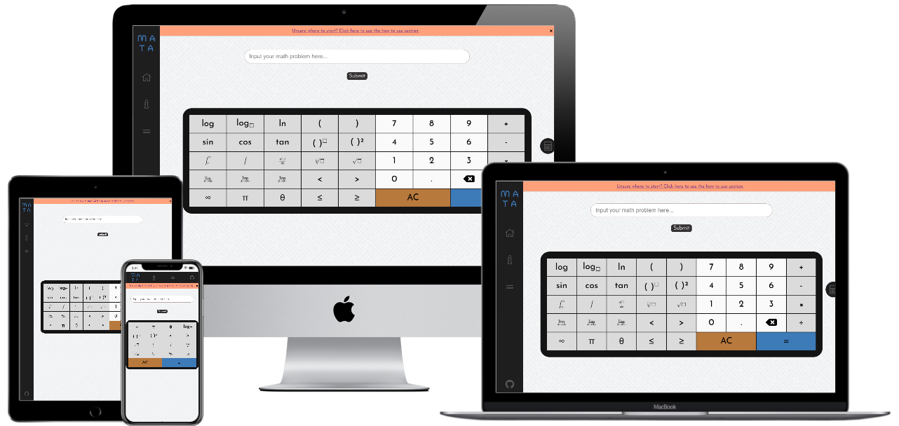

# Mata - Mathematics Solver

This is a web app that solves mathematical problems and displays a step by step solution on how to do the problem.
It is designed to be used as a tool by secondary school mathematics students to help with their studies.

A student can input a problem they are working on with the help of a virtual keyboard and will get a result 
with step buttons that, once clicked, reveals the next step of the solution.
My thinking behind this is that instead of getting the answer and bypassing the method, the students can reveal
the steps individually and get a better understanding of what they're studying.
It would be particularly helpful for questions in a homework set that are most difficult or if a student didn't 
understand a particular topic or how to apply it to problems. 

It was made as my second project with the [Code Institute](https://codeinstitute.net/) in Dublin.



A live version of the site is available [here](https://162tmac.github.io/mata-mathematics-solver/).
 
## UX
 
I wanted to create a web app that was easy to use and gave a good user experience.
A main feature of the website is to for users to reveal only parts of an answer so they benefit in working along with the step by step solution.

### User stories

#### First Time Visitor Goals

1. As a First Time Visitor, I want to understand what the website does and how to use it.
2. As a First Time Visitor, I want to easily navigate the site through intuitive calls to action.
3. As a First Time Visitor, I want to see the solver in action.

#### Returning User Goals

1. As a Returning User, I want to rely on the solver for math problems from various areas of mathematics.
2. As a Returning User, I want to use the website as an online space that I go to anytime I study mathematics.
3. As a Returning User, I want to use the website to improve my skills at mathematics in an understandable way.

### Design
#### Colour Scheme
The main colours I used are shades of dark and light grey, blue and white generated using [coolors.co](https://coolors.co/).
#### Typography
The Turret Road font is used in the NavBar and headings throughout the site. I thought it was a cool design that gives the website and solver a machine like touch.
The Josefin Sans font is used for any other font on the page with Sans-Serif as a backup, fonts often used on websites to contrast the unique Turret Road Style.
As the results are generated dynamically by MathJax in an object, they have their own font styles for the mathmatical symbols.
#### Background
I used a background for the site found at [toptal.com](https://www.toptal.com/designers/subtlepatterns/) that gives a more pleasant appeal rathar than a plain white background.

The pattern I used can be found here: [www.toptal.com/designers/subtlepatterns/interlaced/](https://www.toptal.com/designers/subtlepatterns/interlaced/)

#### Wireframes
Here is a pdf of the wireframes I did before starting my project:
 
 [Mata - Mathematical Solver Wireframes](wireframes/project-2-wireframes.pdf)

Originally, I wanted to include a page where students could study proofs but as proofs could be just entered into the solver, it seemed unnecessary and I included some example queries instead.

Apart from that, the design didn't change much and I think worked quite well because of the planning I did.

## Features

### Existing Features
- Mathematics Solver - Allows users to solve math problems by inputting the problem into a searchbar which sends a query to the Wolfram Alpha API and returns an answer.
- Mathematicical Keyboard - Allows user to input mathematical functions and operations into the searchbar in the correct format.
- Step by Step Results - Allows users to reveal the answer from the above query in parts.
- Side Calculator - Allows users to calculate quick and smaller calculations that can be done separate to the main solver.

### Features Left to Implement
- I would like the web app to allow uses to be able to display step by step solutions which show how to graph problems which
it currently doesn't support.

## Technologies Used

* [Wolfram Alpha's API](https://products.wolframalpha.com/api/)
    * My project sends querys to **Wolfram Aplha**'s API which then returns a MathMl object that can be displayed to users.
* [MathJax](https://www.mathjax.org/)
    * I used the **MathJax** library to render the mathematical symbols and equations throughout the site.
* HTML5 & CSS3
* Javascript
* [Google Fonts](https://fonts.google.com/)
    - Google fonts were used to import the 'Turret Road' and 'Josefin Sans' fonts into the style.css file which are used on all pages throughout the project.
* [Font Awesome](https://fontawesome.com/)
    * This projects makes use of **Font Awesome** for displaying eye-catching icons throughout the site.
* [Git](https://git-scm.com/)
    * Git was used for version control by utilizing the Gitpod terminal to commit to Git and Push to GitHub.
* [GitHub](https://github.com/)
    * GitHub is used to store the projects code after being pushed from Git.
* [Balsamiq](https://balsamiq.com/)
    * Balsamiq was used to create the [wireframes](wireframes/project-2-wireframes.pdf) during the design process.


## Testing

The W3C Markup Validator and W3C CSS Validator Services were used to validate every page of the project to ensure there were no syntax errors in the project.

/*/*//*//*/*/*/*//*/*/*/*/*/*/*/TODO

-   [W3C Markup Validator](https://jigsaw.w3.org/css-validator/#validate_by_input) - [Results](https://github.com/)
-   [W3C CSS Validator](https://jigsaw.w3.org/css-validator/#validate_by_input) - [Results](https://github.com/)

### Testing User Stories from User Experience (UX) Section

#### First Time Visitor Goals

* As a First Time Visitor, I want to understand what the website does and how to use it.

    1. There is a banner when landing on the page that directs the user to the how to use section if they want to understand how to use the solver.
    2. When the user enters the site, they can see a input field and a keyboard where they can input their math queries.
    3. The how to section in the navigation bar shows the user how to use the solver.

* As a First Time Visitor, I want to easily navigate the site through intuitive calls to action.

    1. The navigation of the site is intuitive and the navbar flows easily with all links bring you to what you would expect to find.
    2. The navbar always remains at the side for large screens and at the top for smaller devices. This allows the user to always be able to use it no matter how far they scroll down the page.
    3. The side calculator works intuitively and directs the user away from the main solver when they use it. A blocker greys out the solver when this side calculator is in use.

* As a First Time Visitor, I want to see the solver in action.
    1. The how to page shows exactly how to use the solver so users can get to work quickly.
    2. The query bar is the first thing the user sees and their attention is drawn to using it. The keyboard gives the user multiple calls to action to use it.
    3. There examples page gives the users a range of example queries to input into the solver.

#### Returning User Goals

* As a Returning Users, I want to rely on the solver for math problems from various areas of mathematics.

    1. The step by step result section works quite well for many areas of maths. 
    2. I have tested the solver with many queries from different areas of maths, most of them taken from the examples given in the Wolfram Alpha website.

* As a Returning Users, I want to use the website as an online space that I go to anytime I study mathematics.

    1. The students can use to the step by step feature to get a better understanding on how to complete math problems.
    2. The side calculator allows for smaller and quick calculations so students don't have to leave the site.

* As a Returning User, I want to use the website to improve my skills at mathematics in an understandable way.
    1. The solver can help student to understand more difficult questions. This is especially important for questions at the end of a problem set that are more difficult or complicated than the previous questions but from the same area of maths.
    2. As the student uses the solver a few times it becomes much easier and intuitive to use.
    3. The solver also can solve proofs and give the solution step by step which is often quite difficult for math students. As each step of the proofs is important, the website works well and is exact.

### Further Testing

-   The site was tested for responsiveness and design on desktops, tablets and smartphone.
-   I had a couple of my friends who work as developers test the site also to try to find bugs.
-   A large amount of testing was done to check that the solver was working for many different math problems. There is a list of the extensive test queries I ran here:
    - [Mata Tests](tests.md)

### Known Bugs

-   There is a bug when handling differential equations. This has to do with how the MathML is being generated. Right now it returns an error but as they aren't part of the secondary math syllabus, I will fix it in the future.
-   The MathJax library sometimes is slow to load the representation of the math symbols taken from the MathML and LaTeX throughout the site.

## Deployment

My project has been deployed on GitHub Pages and can be viewed here: https://162tmac.github.io/mata-mathematics-solver/

### GitHub Pages

The project was deployed to GitHub Pages using the following steps...

1. Log in to GitHub and locate the [GitHub Repository](https://github.com/)
2. At the top of the Repository (not top of page), locate the "Settings" Button on the menu.
3. Scroll down the Settings page until you locate the "GitHub Pages" Section.
4. Under "Source", click the dropdown called "None" and select "Master Branch".
5. The page will automatically refresh.
6. Scroll back down through the page to locate the now published site [link](https://162tmac.github.io/mata-mathematics-solver/) in the "GitHub Pages" section.

### Forking the GitHub Repository

By forking the GitHub Repository we make a copy of the original repository on our GitHub account to view and/or make changes without affecting the original repository by using the following steps...

1. Log in to GitHub and locate the [GitHub Repository](https://162tmac.github.io/mata-mathematics-solver/)
2. At the top of the Repository (not top of page) just above the "Settings" Button on the menu, locate the "Fork" Button.
3. You should now have a copy of the original repository in your GitHub account.

### Making a Local Clone

1. Log in to GitHub and locate the [GitHub Repository](https://162tmac.github.io/mata-mathematics-solver/)
2. Under the repository name, click "Clone or download".
3. To clone the repository using HTTPS, under "Clone with HTTPS", copy the link.
4. Open Git Bash
5. Change the current working directory to the location where you want the cloned directory to be made.
6. Type `git clone`, and then paste the URL you copied in Step 3.

```
$ git clone https://162tmac.github.io/mata-mathematics-solver/
```

7. Press Enter. Your local clone will be created.

```
$ git clone https://162tmac.github.io/mata-mathematics-solver/
> Cloning into `CI-Clone`...
> remote: Counting objects: 10, done.
> remote: Compressing objects: 100% (8/8), done.
> remove: Total 10 (delta 1), reused 10 (delta 1)
> Unpacking objects: 100% (10/10), done.
```

Click [Here](https://help.github.com/en/github/creating-cloning-and-archiving-repositories/cloning-a-repository#cloning-a-repository-to-github-desktop) to retrieve pictures for some of the buttons and more detailed explanations of the above process.


## Credits

### Acknowledgements

- I used the [MathJax](https://www.mathjax.org/) library to render the mathematical symbols and equations throughout the site.
- I got inspiration for my navbar from the Fireship Youtube channel.
- Tutor support at Code Institute for their support.
- I'd like to thank my mentor Gurjot Singh for all the help and advice during the development of the website
